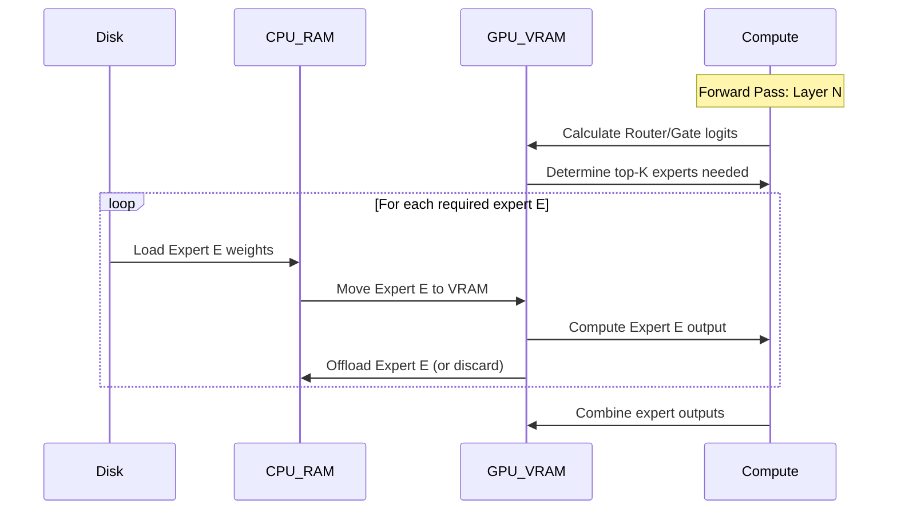

# VRAM Management Architecture

## 1. Overview

The core value proposition of AirLLM is **100% local inference** of massive LLMs (70B+) on consumer hardware (4GB-24GB VRAM). No cloud APIs, no subscriptions — your hardware, your models, forever. The current implementation achieves this via layer-by-layer inference, loading one transformer block into VRAM, executing the forward pass, and offloading it. However, the current approach has limitations:

- **MoE Bottleneck:** Mixture of Experts (MoE) models (e.g., Mixtral, Mistral Small 4, DeepSeek-V3) have massive individual layers (often >10GB per layer due to experts). A single layer might exceed available VRAM on a 4GB/8GB GPU.
- **KV Cache Bottleneck:** Long context windows consume significant VRAM for the KV cache, eventually causing OOMs even if the model weights are offloaded.
- **Prefetching + Quantization:** Currently, prefetching (loading layer $N+1$ while layer $N$ computes) is disabled when quantization (4-bit/8-bit) is active, severely impacting inference speed.

This document outlines the new VRAM management architecture to address these issues.

## 2. Current Approach Analysis

The current `AirLLMBaseModel.forward` loop:

1. Loads layer $N$ from disk to CPU RAM.
2. Moves layer $N$ to GPU VRAM.
3. Executes forward pass for layer $N$.
4. Moves layer $N$ to `meta` device (offloads).
5. Repeats for layer $N+1$.

**Issues:**

- If layer $N$ (e.g., a DeepSeek MoE layer with 256 experts) is 15GB, it crashes a 12GB GPU immediately.
- The KV cache for all previous tokens is kept entirely in VRAM.
- `prefetching=True` uses a separate CUDA stream to load layer $N+1$ while layer $N$ computes, but this is explicitly disabled if `compression` is set, likely due to `bitsandbytes` quantization overhead or CUDA stream synchronization issues with quantized tensors.

## 3. MoE VRAM Optimizations

To support massive MoE models (Mistral Small 4, DeepSeek-V3) on low VRAM, we will implement two strategies within the new `AirLLMMoEModel` base class.

### 3.1. Expert-by-Expert Loading Strategy

Instead of loading the entire MoE layer (which contains all experts), we will load experts individually or in small batches.



**Implementation Details:**

- The router (gate) weights are loaded first.
- The router computes which experts are needed for the current batch of tokens.
- Only the required experts (e.g., top-2 out of 256) are loaded from disk to VRAM.
- This drastically reduces the VRAM requirement for a single MoE layer from $O(\text{Total Experts})$ to $O(\text{Active Experts})$.

### 3.2. Intra-Layer Chunking Design

For extremely low VRAM (e.g., 4GB) or when even a single expert/dense layer is too large, we will split the layer computation itself.

- **Attention Chunking:** Split the $Q, K, V$ projections and attention computation along the sequence or head dimension.
- **FFN Chunking:** Split the Feed-Forward Network (or Expert) computation along the hidden dimension. Compute `FFN(x)[0:half]` then `FFN(x)[half:end]` and concatenate.

## 4. KV Cache Offloading Strategy

For long context windows (e.g., >32k tokens), the KV cache becomes the primary VRAM consumer.

**Strategy: Paged KV Cache with CPU Offloading**

1. **Chunking:** Divide the KV cache into blocks (e.g., 256 tokens per block).
2. **Offloading:** Keep only the most recently accessed or most critical blocks in VRAM. Offload older blocks to CPU RAM (or even NVMe SSD).
3. **Prefetching:** When attention computation requires older blocks, asynchronously prefetch them from CPU RAM to VRAM via PCIe.
4. **Integration:** We will integrate with `transformers.cache_utils.DynamicCache` or implement a custom `OffloadedCache` class that manages this swapping transparently to the model's forward pass.

## 5. Enabling Prefetching + Quantization

Currently, `self.prefetching = False` if `self.compression is not None`.

**Root Cause:** `bitsandbytes` quantization (e.g., `quantize_nf4`) is synchronous and blocks the CUDA stream, or the state dict manipulation for quantized tensors isn't thread-safe in the current implementation.

**Solution:**

1. **Pre-Quantization:** The current `split_and_save_layers` actually pre-quantizes the weights and saves them to disk in 4-bit/8-bit format.
2. **Stream Synchronization:** We will ensure that loading the pre-quantized tensors from disk to CPU, and then moving them to GPU, happens on a dedicated non-blocking CUDA stream.
3. **De-quantization (if needed):** If dynamic de-quantization is required during the forward pass, it will be strictly isolated to the compute stream, while the memory transfer stream handles the next layer's quantized weights.

## 6. VRAM Tier Detection & Automatic Configuration

We will implement an automatic configuration system that detects available hardware and sets optimal parameters.

```python
# airllm/utils/hardware.py
import torch
import psutil

def detect_vram_tier() -> str:
    if not torch.cuda.is_available():
        return "cpu"

    total_vram_gb = torch.cuda.get_device_properties(0).total_memory / (1024**3)

    if total_vram_gb <= 6:
        return "4GB"
    elif total_vram_gb <= 10:
        return "8GB"
    elif total_vram_gb <= 14:
        return "12GB"
    elif total_vram_gb <= 20:
        return "16GB"
    else:
        return "24GB+"

def get_optimal_config(model_size_params, vram_tier):
    # Returns optimal settings for:
    # - compression ('4bit', '8bit', None)
    # - kv_cache_offload (True/False)
    # - expert_loading_strategy ('all', 'active_only')
    pass
```

Users will be able to override these defaults, but the out-of-the-box experience will automatically prevent OOMs based on the detected tier.
